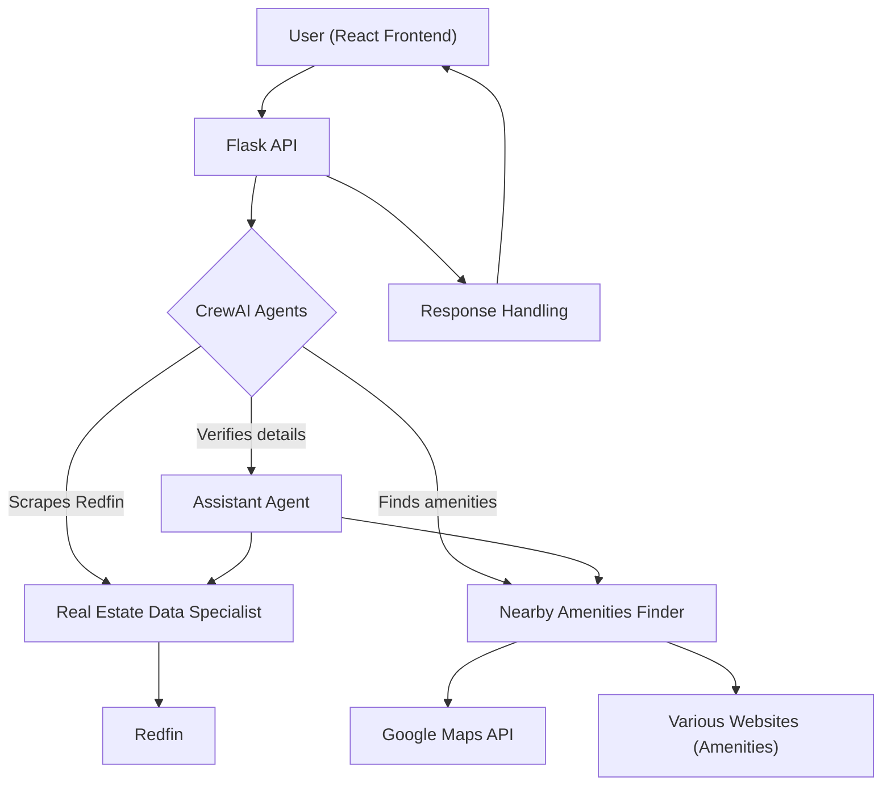

# Property Details and Nearby Amenities Finder

## Project Description

The Property Details and Nearby Amenities Finder is a web application that allows users to search for detailed property information and nearby amenities for a given address. The project uses **React** for the frontend and **Flask** for the backend to fetch property details and amenities such as grocery stores, hospitals, pharmacies, gyms, and restaurants.

The application provides detailed property information like price, bedrooms, bathrooms, square footage, lot size, HOA fees, and property taxes, as well as school ratings and crime rates. The user can also view a list of nearby amenities like grocery stores, hospitals, pharmacies, gyms, and restaurants, along with their distances from the property.

## Features
- Search for property details by address.
- Displays property information including price, bedrooms, bathrooms, and more.
- Displays nearby amenities (grocery stores, hospitals, pharmacies, gyms, restaurants).
- Uses an API to fetch property details and amenities data.

# Architecture Overview


## The system consists of three main layers:
- **Frontend (React)** – User Interface  
- **Backend (Flask & CrewAI Agents)** – Handles business logic, agents, and data processing  
- **External Services** – Redfin, Google APIs, and other external sources  


## Components & Workflow  

### 1. User Interaction (React Frontend)  
- User inputs a location or property address.  
- The frontend sends a request to the Flask API.  

### 2. Flask API & CrewAI Agents (Backend)  
- Flask receives the request and triggers **CrewAI Agents**.  
- Agents perform the following tasks:  
  - **Real Estate Data Specialist** → Scrapes Redfin for property listings.  
  - **Nearby Amenities Finder** → Uses `ScrapeWebsiteTool` to find nearby amenities (grocery stores, hospitals, gyms, etc.).  
  - **Assistant Agent** → Verifies and cross-checks property details before sending them to the frontend.  

### 3. External Integrations  
- CrewAI agents use `ScrapeWebsiteTool` to extract real-time property data from Redfin.  
- **Google Maps API** (or other location-based APIs) helps find nearby amenities.  

### 4. Response Handling  
- The Flask backend processes the agent results and structures them into a response.  
- The React frontend displays the results in a user-friendly format.  

## Requirements

- Python 3.x
- Node.js (for React frontend)
- Flask
- Other Python dependencies listed in `requirements.txt`

## Backend Setup (Flask API)

### Install Backend Dependencies

1. Clone this repository.
2. Navigate to the project directory in the terminal.
3. Create a virtual environment:
   ```bash
   python -m venv venv
   ```
4. Activate the virtual environment:
    On Windows:
        ```bash
        venv\Scripts\activate
        ```
    On macOS/Linux:
        ```bash
        source venv/bin/activate
        ```
5. Install backend dependencies:
    ```bash
    pip install -r requirements.txt
    ```

### Run Flask Backend

1. Set up environment variables if needed (e.g., API keys) in a .env file.
2. Start the Flask server:
    ```bash
    python agent.py
    ```
    The backend will be available at http://127.0.0.1:5000/.

## Frontend Setup (React)

### Install Frontend Dependencies

1. Navigate to the frontend directory:
    ```bash
    cd property-frontend
    ```

2. Install the required Node.js dependencies:
    ```bash
    npm install
    ```

## Run React Frontend

1. Start the React development server:
    ```bash
    npm start
    ```
    The frontend will be available at http://localhost:3000/.

## How to Use

1. Open the web application in your browser.
2. Enter a property address in the search input field.
3. Click the "Search" button to fetch property details and nearby amenities.
4. View the property details and nearby amenities displayed on the screen.

## Troubleshooting

- Ensure the Flask server is running before starting the React frontend.
- If you encounter issues with CORS, make sure flask-cors is correctly configured in the backend.
- Check the network requests in the browser's Developer Tools to debug any issues related to API calls.
